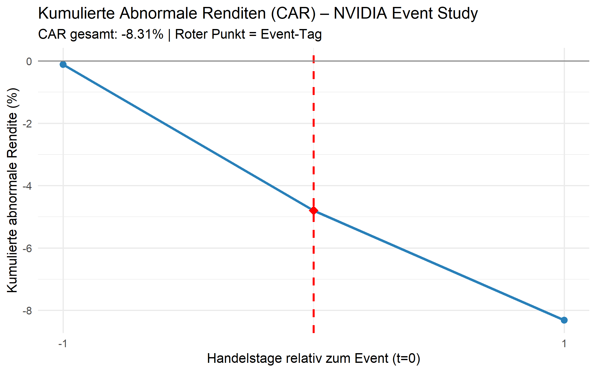

# Event Study: Abnormale Rendite NVIDIA

Klassische **Event Study** in R zur Analyse der abnormalen Rendite der NVIDIA-Aktie rund um die Q4 FY2025-Quartalsergebnisse am **26. Februar 2026**.

## Hintergrund

NVIDIA veröffentlichte am 25. Februar 2026 (nach Börsenschluss) Rekordergebnisse (Umsatz +100% YoY). Trotzdem reagierte die Börse mit Kursverlusten von ca. -5%. Dieses Projekt untersucht mithilfe des **CAPM-Modells**, wie stark diese Reaktion von der statistisch erwarteten Rendite abwich.

## **Wichtiger Hinweis zum Event-Tag:**
Da die News erst *nach* Handelsende am 25.02. veröffentlicht wurden, ist das statistische Event-Datum ($t=0$) im Code auf den **26.02.2026** gesetzt. Das ist der erste Tag, an dem der Markt auf die Informationen reagieren konnte.

## Methodik 

| Schritt | Beschreibung |
|---|---|
| 1 | Kursdaten von Yahoo Finance laden (NVIDIA + S&P 500) |
| 2 | **Estimation Window** (120 Handelstage) → CAPM-Parameter α und β via OLS schätzen |
| 3 | **Event Window** [-10, +10] → Erwartete Rendite berechnen |
| 4 | **Abnormale Rendite** AR = tatsächliche − erwartete Rendite |
| 5 | **Kumulierte abnormale Rendite** CAR = Summe aller AR |

### Formeln

```
E[r_NVDA,t] = α + β × r_Markt,t
AR_t        = r_NVDA,t − E[r_NVDA,t]
CAR         = Σ AR_t
```

## Voraussetzungen

- R (Version 4.0 oder höher)
- Die benötigten Pakete werden beim ersten Start automatisch geprüft und installiert.

## Schnellstart

Um die gesamte Analyse (Datenladen, Schätzung, Berechnung der AR/CAR und Plots) auszuführen, öffne das Projekt in RStudio und führe das Hauptskript aus:

```r
source("main.R")

## Parameter anpassen

```r
event_date        <- as.Date("2026-02-26")  # Datum des Events
event_window_pre  <- 1                      # Tage VOR dem Event
event_window_post <- 1                      # Tage NACH dem Event
estimation_days   <- 252                    # Länge des Estimation Windows
ticker_stock      <- "NVDA"                  # Aktie (z.B. "AAPL", "MSFT" ...)
ticker_market     <- "^GSPC"                 # Marktindex
```

## Ausgabe

- CAPM-Regressionsergebnis (α, β, R²)
- Tabelle: AR und CAR pro Tag im Event Window
- AR₀ und CAR in % als Kennzahlen
- Zwei ggplot2-Grafiken (Balkendiagramm AR + Linienchart CAR)



## Ergebnisinterpretation

| Kennzahl | Bedeutung |
|---|---|
| AR₀ < 0 | Schlechter als vom CAPM erwartet am Event-Tag |
| CAR < 0 | Negative Gesamtreaktion über das Event Window |
| β > 1 | NVIDIA volatiler als der Gesamtmarkt |


